# 🧠 TruthMinder-Agent  
**A Multimodal Disinformation Detection System using CLIP, ViLT, and FLAVA**

[](https://www.python.org/)
[](https://streamlit.io/)
[](https://huggingface.co/)
[](LICENSE)

---

## 🚀 Overview
**TruthMinder-Agent** is an agentic AI system designed to detect **misinformation** in online news posts using a **multimodal pipeline** that analyzes both **text and images**, supported by **metadata** and **logical consistency checks**.

This project extends my **Master's Thesis in Web and Data Science (University of Koblenz, 2025)** — accepted for publication at **ACM DHOW 2025 (Dublin)** — and integrates the best-performing models (CLIP, ViLT, FLAVA) into an interactive **Streamlit dashboard**.

---

## 🧩 Core Features
- **Multimodal Fusion** of text, image, and post metadata  
- **Ensemble of Pretrained Models** – CLIP, ViLT, and FLAVA  
- **Evidence Layer** – OCR-based text extraction from images  
- **Consistency Layer** – Natural Language Inference (NLI) for logical checks  
- **Arbiter Module** – Final decision fusion with abstain/uncertain handling  
- **Interactive UI** – Streamlit-based visualization and test interface  

---

## 🧭 System Architecture

The TruthMinder-Agent follows a modular agentic workflow consisting of four main reasoning stages:

```mermaid
flowchart LR
    A["🧠 Perception<br/>CLIP · ViLT · FLAVA"] --> B["📜 Evidence<br/>OCR Extraction"]
    B --> C["🔍 Consistency<br/>NLI + CLIP Similarity"]
    C --> D["⚖️ Arbiter<br/>Decision Fusion"]
    D --> E["✅ Final Label<br/>(Real · Satire/Mixed · Fake)"]
```



---

## 🧩 Core Components

The TruthMinder-Agent project is structured into clear modular layers to ensure transparency, maintainability, and reproducibility.

| Folder / File | Description |
|----------------|-------------|
| **agent/** | Core orchestration logic for the multimodal AI agent. Contains `runner.py`, which manages the Perception → Evidence → Consistency → Arbiter workflow. |
| **models/** | Inference scripts for the three pretrained transformer models — **CLIP**, **ViLT**, and **FLAVA** — each adapted for binary (2-way) and ternary (3-way) disinformation classification. |
| **tools/** | Utility modules for auxiliary reasoning: **OCR extraction**, **NLI consistency checking**, **cosine similarity**, and **explainability** utilities. |
| **app/** | Streamlit-based user interface where users can upload, analyze, and visualize results interactively. |
| **evaluate/** | Scripts to regenerate and evaluate model metrics (accuracy, F1-score, precision, recall, Cohen's Kappa) from checkpoints. |
| **results/** | Stores evaluation plots such as confusion matrices, ROC and Precision-Recall curves for CLIP, ViLT, and FLAVA models. |
| **outputs/** | Contains final agent outputs — including `enriched.csv` (batch predictions) and JSON traces for each processed post. |
| **training/** | Training utilities including learning rate finder, trainers, and evaluators used during model fine-tuning. |
| **datasets/** | Preprocessing and dataset construction scripts for the Fakeddit dataset. Handles text cleaning, label encoding, and metadata normalization. |
| **runs/** | TensorBoard-compatible experiment logs for model training sessions. |
| **requirements.txt** | Python dependencies required to run the project. |
| **README.md** | This documentation file describing the project's structure and purpose. |
| **etl/** | Extract-Transform-Load pipeline for data ingestion from Reddit, NewsAPI, and CSV sources. |
| **airflow_dags/** | Apache Airflow DAG definitions for automated ETL orchestration. |

---

## 🧠 Highlights
- Modularized architecture enables individual testing of CLIP, ViLT, and FLAVA.
- Each layer (Perception → Evidence → Consistency → Arbiter) is fully traceable through JSON logs.
- Enables both **single-post analysis** (interactive UI) and **batch evaluation** (CLI mode).
- Integrated ETL pipeline for automated data ingestion and enrichment.

---

## ⚙️ Installation & Setup

> 🧩 **Recommended**: Use a clean Conda environment with Python 3.9 + PyTorch + Transformers

```bash
# 1️⃣ Clone the repository
git clone https://github.com/Grewal-Pam/truthminder-agent.git
cd truthminder-agent

# 2️⃣ Create & activate a new Conda environment
conda create -n truthminder python=3.9 -y
conda activate truthminder

# 3️⃣ Install dependencies
pip install -r requirements.txt

# 4️⃣ Verify setup
python -c "from tools import ocr; print('✅ OCR module import OK')"
```

---

## 🚀 Running the Agentic Pipeline

> 💡 TruthMinder-Agent supports three execution modes:  
> 1️⃣ **Interactive UI (Streamlit)**  
> 2️⃣ **Background Server Mode (for cloud/VMs)**  
> 3️⃣ **Batch Mode (offline dataset processing)**

---

### ▶️ **Option 1 — Interactive UI (Streamlit)**

Launch the full web dashboard locally:

```bash
streamlit run app/test_app.py --server.port 8501
```

Then open your browser at 👉 **http://localhost:8501**

This allows you to:
- Upload an image + caption pair
- View predictions from CLIP, ViLT, and FLAVA
- Inspect OCR, NLI, and Arbiter reasoning layers
- See the final disinformation label with model confidence
- Explore visualizations of prediction traces

---

### ▶️ **Option 2 — Background Server Mode (🖧 for Cloud/VMs)**

Run the Streamlit app as a background process — ideal for remote servers.

```bash
nohup streamlit run app/test_app.py --server.port 8501 > truthmindr.log 2>&1 &
```

Monitor live logs:
```bash
tail -f truthmindr.log
```

Stop the server when finished:
```bash
pkill -f streamlit
```

---

### ▶️ **Option 3 — Batch Mode (📦 Offline Dataset Processing)**

Run the agent pipeline in non-interactive mode to process an entire dataset:

```bash
python agent/runner.py
```

This will generate:
- `outputs/enriched.csv` → consolidated predictions for all posts
- `outputs/traces/*.json` → per-post reasoning traces with all model outputs

Use this mode for large-scale evaluation, experiments, or model benchmarking.

---

## 🖼️ Example Output & Visualization

When you analyze a post, the agent produces both a **final label** and a **reasoning trace** showing how each layer contributed to the decision.

### 🧾 Example Output (from `outputs/traces/c0xdqy.json`)

```json
{
  "post_id": "c0xdqy",
  "final_label": "Real",
  "final_confidence": 0.86,
  "nli_label": "NEUTRAL_NO_OCR",
  "consistency_score": 0.5886,
  "clip_cos": 0.6477,
  "ocr_text": "",
  "upvote_ratio": "-0.69",
  "score": "-0.11",
  "num_comments": "-0.12"
}
```

### 🧠 Interpretation

- **Perception Layer:** CLIP + ViLT + FLAVA predict probabilities for Real, Satire/Mixed, and Fake.
- **Evidence Layer:** No OCR text detected (ocr_text = "").
- **Consistency Layer:** NLI judged the image–caption relation as neutral.
- **Arbiter Layer:** Aggregated model probabilities → highest confidence = Real (0.86).

Each analyzed post is saved as:
- `outputs/enriched.csv` → all predictions in one file
- `outputs/traces/<post_id>.json` → detailed reasoning trace

---

## 📊 Evaluation Results & Performance Summary

The TruthMinder-Agent integrates three multimodal transformer backbones — **CLIP**, **ViLT**, and **FLAVA** — fine-tuned on the Fakeddit dataset for 2-way and 3-way disinformation classification tasks, both **with** and **without metadata**.

| Model | Task | Accuracy | F1-Score | Cohen's Kappa | Metadata Used | Notes |
|:------|:-----|:---------:|:--------:|:--------------:|:--------------:|:------|
| **CLIP** | 2-way | 0.924 | 0.921 | 0.843 | ✅ | Robust visual–text alignment |
| **CLIP** | 3-way | 0.802 | 0.796 | 0.684 | ✅ | Best visual reasoning performance |
| **ViLT** | 2-way | 0.887 | 0.885 | 0.769 | ✅ | Fastest inference, moderate accuracy |
| **ViLT** | 3-way | 0.752 | 0.742 | 0.621 | ✅ | Balanced multimodal fusion |
| **FLAVA** | 2-way | 0.901 | 0.896 | 0.812 | ✅ | Best metadata sensitivity |
| **FLAVA** | 3-way | 0.786 | 0.775 | 0.657 | ✅ | Most balanced across modalities |

> 📘 *These results are drawn from Parminder Grewal's master's thesis (University of Koblenz, 2025) and correspond to the official ACM DHOW 2025 submission.*

---

### 🎯 Key Insights
- Metadata (upvote ratio, score, comments) consistently improved all model metrics.  
- CLIP achieved the highest F1 in visual-heavy samples.  
- FLAVA provided the most stable metadata fusion.  
- ViLT offered lightweight, efficient inference for real-time scenarios.

---

### 📈 Visualization Samples

| Model | 2-way ROC Curve | 3-way Confusion Matrix |
|:------|:----------------:|:----------------------:|
| **CLIP** |  |  |
| **ViLT** |  |  |
| **FLAVA** |  |  |

> *(If running locally, the `results/` folder contains all plots and metrics JSON files for detailed inspection.)*

---

## 🚀 Future Directions

TruthMinder-Agent currently implements a full multimodal disinformation detection pipeline with OCR and NLI-based reasoning.  
Next planned enhancements include:

- **Verifier LLM Integration** → adds final human-like judgment based on trace data.  
- **Retrieval-Augmented Generation (RAG)** → links suspicious posts to credible news sources for evidence-backed verification.  
- **Explainability Module** → highlights image/text regions influencing the model's decision.  
- **Risk–Coverage & Calibration** → measures model confidence and abstention reliability.  
- **FastAPI Deployment** → enables lightweight API-based inference for integration into external products.

> 🧩 Long-term vision: evolve TruthMinder-Agent into a **self-explaining, evidence-aware disinformation verification assistant** capable of cross-modal reasoning and traceable outputs.

---

## 🧾 Citation

If you use or build upon this work, please cite:

```bibtex
@inproceedings{Grewal2025,
   author = {Parminder Kaur Grewal and Marina Ernst and Frank Hopfgartner},
   city = {New York, NY, USA},
   doi = {10.1145/3746275.3762205},
   isbn = {9798400720574},
   booktitle = {Proceedings of the 2nd International Workshop on Diffusion of Harmful Content on Online Web},
   month = {10},
   pages = {75-83},
   publisher = {ACM},
   title = {Beyond Text: Leveraging Vision-Language Models for Misinformation Detection},
   url = {https://dl.acm.org/doi/10.1145/3746275.3762205},
   year = {2025}
}
```

---

## 📚 Additional Resources

- **ETL Pipeline:** See [etl/README.md](etl/README.md) for data ingestion and processing.
- **Airflow Orchestration:** See [airflow_dags/README.md](airflow_dags/README.md) for scheduled pipeline automation.
- **Master's Thesis:** Available at [ACM DHOW 2025 Proceedings](https://dl.acm.org/doi/10.1145/3746275.3762205)

---

## 📝 License

This project is licensed under the MIT License - see the [LICENSE](LICENSE) file for details.

---

**Author:** Parminder Kaur Grewal  
**Institution:** University of Koblenz, Germany  
**Last Updated:** December 2, 2025

